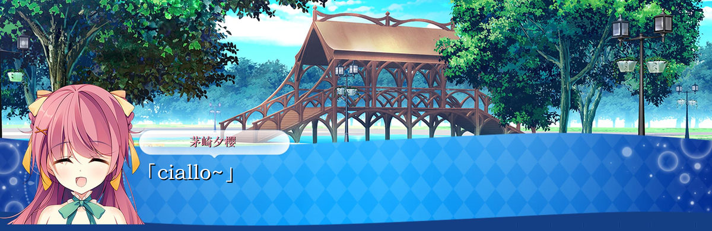

# 茅崎夕樱 · 对话框生成器（基于《魔法少女的魔女审判》文本框工具二创）

> ⚠️ 本项目为 **个人学习 / 交流用的二次开发工具**，  
> 不代表原项目作者立场，也不用于任何商业用途。

---

## 项目概要

这个小工具是基于 GitHub 上的开源项目  
**「Text_box-of-mahoushoujo_no_majosaiban」** 修改而来。

原项目作者用心还原了《魔法少女的魔女审判》的对话框效果、文本自适应算法和角色立绘系统，我只是站在巨人的肩膀上做了一点点「懒人向」改造，把它简化成：

- 单角色版本：**茅崎夕樱**
- 一键生成：按下回车就把当前输入框文字变成游戏风对话图片
- 自动加上：
  - 底部蓝色对话框 + 白色气泡名字框
  - 上方背景 + 立绘
  - 名字「茅崎夕樱」
  - 对话文本自动添加日式引号 `「」`

所有真正重要、厉害的部分（算法 / 绘制逻辑等）都来自原作者。  
这个仓库只是一个 **针对个人使用场景的定制版封装**。

---

## 效果示例



---

## 与原项目的关系与致谢

- 原项目仓库：`Text_box-of-mahoushoujo_no_majosaiban`  
- 本仓库仅在此基础上做了：
  - 删除多角色配置，只保留水葬银货的 **茅崎夕樱（yura）**
  - 固定布局：立绘 + 文本框 + 名字条
  - 简化快捷键与使用流程
  - 自动为对话文本加上 `「」`

非常感谢原作者开放源码、详细注释以及资源文件，让我有机会学习到：

- 文本自适应绘制（自动换行、缩放字号）
- 立绘与背景的合成方式
- 键盘监听 / 剪贴板操作 等实用技巧

本项目的存在完全是出于 **学习与个人兴趣**，  
如果原作者认为本仓库有任何不妥之处，我会第一时间配合修改或删库。

---

## 功能简介

- 单角色：**茅崎夕樱**
- 多表情支持：预生成「背景 + 立绘 + 文本框」的组合图
- 文本功能：
  - 自动从当前输入框中剪切文本
  - 自动在文本外添加 `「」`
  - 文本在底部蓝色对话框内自动排版
- 名字显示：
  - 名字固定为「茅崎夕樱」
  - 显示在上方白色小气泡中
- 输出：
  - 生成后的图片自动写入剪贴板
  - 可选自动粘贴 + 回车发送（适合聊天软件）

---

## 环境要求

> 当前脚本主要在 **Windows + Python 3.x** 环境下使用。

依赖的第三方库（大致如下，可按需调整）：

```bash
pip install pillow keyboard pyperclip pywin32
````

项目依赖的文件（来自原项目）包括但不限于：

* `text_fit_draw.py`
* `image_fit_paste.py`
* `background/c1.png` ~ `c16.png`
* `yuraa/yuraa (1).png` 等立绘资源
* `LXGWWenKai-Medium.ttf`（对白字体）
* `textbox_bg.png`（你自定义的底部对话框背景）

---

## 使用方法

1. **准备资源**

   确保以下结构存在（示例）：

   ```text
   .
   ├─ main.py                # 本仓库提供的精简版脚本
   ├─ text_fit_draw.py
   ├─ image_fit_paste.py
   ├─ LXGWWenKai-Medium.ttf
   ├─ textbox_bg.png         # 底部蓝色条+白色泡泡
   ├─ background/
   │    ├─ c1.png
   │    ├─ ...
   ├─ yuraa/
        ├─ yuraa (1).png
        ├─ ...
   ```

2. **安装依赖**

   ```bash
   pip install pillow keyboard pyperclip pywin32
   ```

3. **运行脚本**

   ```bash
   python main.py
   ```

   首次运行会在：

   ```text
   文档（Documents）/ 夕樱
   ```

   下预生成若干张组合底图（背景 + 立绘 + 对话框），
   这个过程会稍微慢一点，仅第一次需要。

4. **在聊天软件中使用**

   * 激活你想要生成文字的输入框（例如 QQ / 微信 / 其他）
   * 输入一段文字（例如：``）
   * 按下 **Enter**：

     * 脚本会自动：

       * 全选并剪切输入框里的内容
       * 生成对话框图片（带 `「...」`）
       * 把图片写入剪贴板，并自动粘贴 + 发送（可在配置关闭）

---

## 快捷键说明

* `Enter`：生成图片并（可选）自动发送
* `Alt + 1~9`：切换不同表情（对应立绘文件）
* `Ctrl + Tab`：清空预生成图片缓存（`文档/魔裁` 下的 jpg）
* `Esc`：退出脚本

---

## 注意事项

* 本项目 **不包含任何商业授权**，所有立绘 / 背景等资源版权归原权利方所有。
* 本仓库仅作 **技术学习与个人研究使用**：

  * 请勿用于商业用途
  * 请勿用于任何侵犯版权的行为
* 如有侵权或不妥之处，请联系我，我会及时处理。

---

## 结语

再次感谢原项目作者提供的优秀代码与资源。
如果你看到这里，对这个小工具也感兴趣，欢迎一起研究 / 改造，也欢迎直接去给原项目点个 Star ⭐。

这个仓库只是一个「茅崎夕樱专用皮肤版」的实践笔记，希望能让喜欢这类 UI 的人少踩一点坑。


